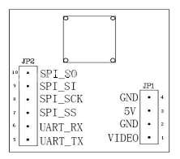

# VC0706-SPI-Serie-ESP8266

##Modification à la [bibliothèque de Seeed Studio](https://github.com/fredericplante/Camera_Shield_VC0706) pour accomoder la platform ESP8266.

  
  
##Définition des broches
  
  

##Le developpement se fera en étapes.
  
  1. Creer un example qui permettra à un module ESP8266 de piloter l'aspect SPI de 
  la caméra afin d'enregistrer les images JPEG dans la mémoire FLASH, ou une carteSD
  L'utilisation du bus SPI permettra l'échange à haut débit.
 
  2. Creer un example qui permettra à un module ESP8266 de piloter la caméra afin de 
  pouvoir récupérer et charger les images JPEG vers un port reseau entrant/sortant.
  
  3. Creer un example qui permettra à un module ESP8266 de piloter la caméra afin de 
  pouvoir récupérer et charger le JPEG vers un écran TFT en utilisant le décompresseur 
  [JPEG_CODEC](https://github.com/fredericplante/JPEG_CODEC).
  
  4. Creer un example qui permettra à un module ESP8266 de piloter la caméra afin de 
  pouvoir récupérer le JPEG et l'enregistrer dans sa mémoire FLASH afin de:
     
     4.1 le decompresser et l'enregistrer sur une carte SD,
     
     4.2 le decompresser et le mettre en page pour transmettre l'informations traitées 
     vers le port Serie secondaire.
     
     
[EOF]

