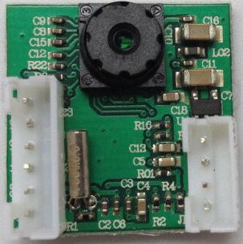

# VC0706-SPI-Serie-ESP8266

##Modification à la [bibliothèque de Seeed Studio](https://github.com/fredericplante/Camera_Shield_VC0706) pour accomoder la platform ESP8266.

  
  
  Définition des broches
  
  

##Le developpement se fera en étapes.
  
  0. Integrer l'aspect SPI au projet. Le caméra JPEG ont tendence utiliser uniquement
  le port Série, le défie sera donc d'exécuter le travail sur deux fronts en simultané.

  1. Creer un example qui permettra à un module ESP8266 de piloter la caméra afin de 
  pouvoir sauver le JPEG dans sa mémoire FLASH, ou une carte SD, en utilisant la révision
  adaptée de la biblotheque [FS.h](https://github.com/esp8266/Arduino/blob/master/doc/filesystem.md)

  2. Creer un example qui permettra à un module ESP8266 de piloter la caméra afin de 
  pouvoir récupérer et charger le JPEG vers un écran TFT en utilisant le décompresseur 
  [JPEG_CODEC](https://github.com/fredericplante/JPEG_CODEC).
  
  3. Creer un example qui permettra à un module ESP8266 de piloter la caméra afin de 
  pouvoir récupérer et charger le JPEG vers un port reseau entrant/sortant.
  
  4. Creer un example qui permettra à un module ESP8266 de piloter la caméra afin de 
  pouvoir récupérer le JPEG et l'enregistrer dans sa mémoire FLASH afin de:
  
     4.1 le decompresser et l'enregistrer sur une carte SD,
     4.2 le decompresser et le mettre en page pour transmition sur un port Serie secondaire.

